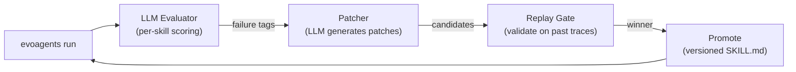

# EvoAgents

**Agents that evolve their own skills. Self-healing multi-agent systems.**

Build multi-agent pipelines with structured skills. EvoAgents watches them run, detects failures with an LLM evaluator, generates targeted prompt patches, validates them via replay on past traces, and promotes winners — automatically. Your agents get better every time they run.

```bash
pip install evoagents
evoagents init --preset research
evoagents run "What are the latest breakthroughs in quantum computing?"
evoagents autofix
evoagents run "What are the latest breakthroughs in quantum computing?"
# Score: 0.67 → 0.83 → 1.00
```

## The Self-Healing Loop



1. **Run** — Execute your pipeline of skills sequentially. Each skill has a prompt, optional tools, and produces structured output.
2. **Evaluate** — An LLM judge scores each skill against its own constraints. No regex, no heuristics.
3. **Patch** — An LLM generates 2-3 minimal, targeted patches to the failing skill's SKILL.md (constraints, examples, output format).
4. **Replay** — Each patch candidate is replayed on recent traces. Only patches that improve scores pass.
5. **Promote** — Winners are versioned (`v1` → `v2` → `v3`). Rollback is always one command away.

## Before & After

**Run 1** (fresh skills, no autofix):
```
Score: 0.67
┃ perception   │  1.00  │ ok
┃ planner      │  0.50  │ findings cut off mid-sentence
┃ synthesizer  │  0.50  │ missing key points from planner
```

**After `evoagents autofix` (synthesizer v1 → v2, planner v1 → v2):**
```
Score: 0.90
┃ perception   │  1.00  │ ok
┃ planner      │  0.80  │ ok
┃ synthesizer  │  1.00  │ ok
```

The patcher added constraints like *"MUST include all named entities from the planner output"* and updated the examples to demonstrate correct behavior — automatically.

## Quickstart

### Install

```bash
pip install evoagents
```

### Initialize a project

```bash
mkdir my-agent && cd my-agent
evoagents init --preset research
```

This creates:
```
my-agent/
  evoagents.yaml          # Pipeline config
  skills/
    perception/           # Extracts intent from queries
      SKILL.md
    planner/              # Searches web + gathers findings
      SKILL.md
    synthesizer/          # Produces final answer
      SKILL.md
```

### Set your API key

```bash
export OPENAI_API_KEY=sk-...
```

### Run and improve

```bash
evoagents run "What is the latest on quantum computing?"
evoagents autofix                    # patches + replay + promote
evoagents run "What is the latest on quantum computing?"  # see improvement
```

### Guide the healing

Tell the patcher what to prioritize:

```bash
evoagents autofix --guide "prioritize citation accuracy over completeness"
evoagents autofix --guide "never remove existing constraints, only add new ones"
```

The `--guide` message becomes the highest-priority instruction for the patcher, overriding default rules.

## Create Your Own Skills

### Interactive creation

```bash
$ evoagents create-skill
Skill name: weather_checker
Description: Check current weather for any city using a weather API

Generating SKILL.md... done
Created skills/weather_checker/SKILL.md (v1)
Add to pipeline? [y/N]: y
Added weather_checker to pipeline
```

The LLM generates a complete SKILL.md with frontmatter, constraints, output format, and examples — ready to run.

### SKILL.md Format

Every skill is a single markdown file with YAML frontmatter:

```markdown
---
name: my_skill
description: >
  What this skill does.
version: v1
tools: []
judge:
  rubric:
    constraints: 0.35
    tool_use: 0.05
    grounding: 0.20
    helpfulness: 0.40
  rules:
    confidence_min: 0.55
---

# My Skill

One-line description.

## When to Use

USE this skill when:
- Condition 1

## Constraints

- MUST do X
- NEVER do Y

## Output Format

Respond with ONLY a JSON object:
{"field": "description"}

## Examples

Query: "example"
Expected output:
{"field": "value"}
```

**Patchable sections:** The autofix loop can modify `constraints`, `output_format`, `examples`, and `tools` — but never touches your `When to Use` or core description.

### Configure your pipeline

**evoagents.yaml:**
```yaml
pipeline:
  - name: step_one
    skill: my_skill
  - name: step_two
    skill: another_skill

skills_dir: ./skills

models:
  executor:
    provider: openai
    model: gpt-5.2
  judge:
    provider: openai
    model: gpt-5.2
```

## CLI Reference

| Command | Description |
|---|---|
| `evoagents init [--preset NAME]` | Scaffold a new project |
| `evoagents run "query"` | Run the pipeline |
| `evoagents autofix [--guide "..."]` | Auto-patch + replay + promote |
| `evoagents autofix --skill NAME` | Target a specific skill |
| `evoagents create-skill` | Interactively create a new skill |
| `evoagents trace last` | Inspect the last run |
| `evoagents list-runs` | List recent runs |
| `evoagents score last` | Score/re-score a run |
| `evoagents failures last` | Show failure tags |
| `evoagents rollback --skill NAME` | Revert to previous version |
| `evoagents versions --skill NAME` | List skill versions |
| `evoagents diff --skill NAME v1 v2` | Diff two prompt versions |
| `evoagents stats` | Aggregate statistics |

## Architecture

```
evoagents (pip package)
├── core/         Pipeline runtime, config, skill loader, trace store
├── scoring/      LLM per-skill evaluator, pairwise judge
├── improve/      Autopatcher, replay gate, promotion manager
├── providers/    LLM abstraction (OpenAI, Anthropic)
├── tools/        Tool registry (web_search, http_get)
├── presets/      Project templates (research, demo, blank)
└── cli/          Typer CLI (run, autofix, create-skill, trace, etc.)
```

## How It's Different

- **Skills, not prompts** — Structured SKILL.md with frontmatter, constraints, output format, examples. Not a blob of text.
- **LLM evaluates LLM** — No regex validators. An LLM judge scores each skill against its own constraints.
- **Section-level patching** — The patcher modifies specific sections (constraints, examples), not the entire prompt. Minimal, targeted fixes.
- **Replay gate** — No patch gets promoted without proving it improves scores on real past traces.
- **Versioned everything** — Every change creates a new version. Rollback is instant.

## Safety

- **Versioning**: Every prompt change creates a new version. Nothing is ever deleted.
- **Replay gate**: No promotion without winning on past traces.
- **Rollback**: `evoagents rollback --skill NAME` to revert any skill instantly.
- **Minimal patches**: The patcher only modifies the sections that caused the failure.
- **Local by default**: All data stays in `.selfheal/` in your project.

## License

MIT
# evoagents
